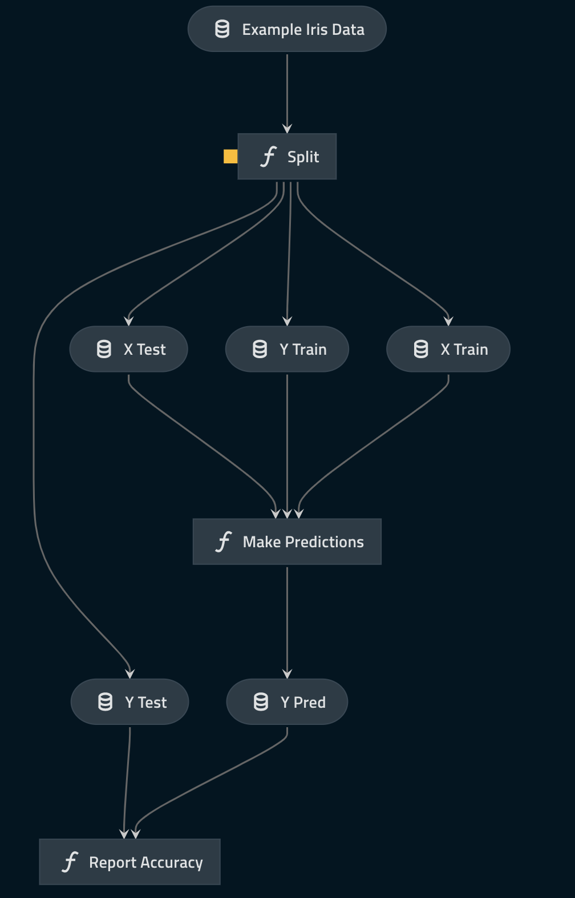

# The `pyspark-iris` Kedro starter, runing on GCP Dataproc Serverless

## Introduction

It's a fork of the [official pyspark-iris starter](https://github.com/kedro-org/kedro-starters/tree/0.18.3/pandas-iris), adjusted to work on [GCP Dataproc Serverless](https://cloud.google.com/dataproc-serverless/docs).

Code in this repository demonstrates a way to run scalable ML pipelines with no need to deploy and maintain any infrastructure in Google Cloud Platform. Kedro project is bundled as Docker image and this image is mounted to driver and executor processes on serverless platform to provide all the dependencies and the code and to ensure the same python version running in all the components.

There is no need to bundle JVM and Spark in the image, as Dataproc Serverless ignores these and uses the internal binaries (see [docs of the custom-containers](https://cloud.google.com/dataproc-serverless/docs/guides/custom-containers#spark)). Your project's Spark version must match the Spark version provided by Dataproc Serverless, see the [runtime version matrix](https://cloud.google.com/dataproc-serverless/docs/concepts/versions/spark-runtime-versions) for more information.

## Getting started

1. Install latest starters version from pypi: `pip install -U getindata-kedro-starters`.
2. Run `kedro new --starter=pyspark-iris-running-on-gcp-dataproc-serverless`.
3. Enter the project directory and follow the README.md file for building the image, pushing it and serverless execution.

## Features

### Single configuration in `/conf/base/spark.yml`

While Spark allows you to specify many different [configuration options](https://spark.apache.org/docs/latest/configuration.html), this starter uses `/conf/base/spark.yml` as a single configuration location.

### `SparkSession` initialisation

This Kedro starter contains the initialisation code for `SparkSession` in the `ProjectContext` and takes its configuration from `/conf/base/spark.yml`. Modify this code if you want to further customise your `SparkSession`, e.g. to use [YARN](https://hadoop.apache.org/docs/current/hadoop-yarn/hadoop-yarn-site/YARN.html).

### Configures `MemoryDataSet` to work with Spark objects
Out of the box, Kedro's `MemoryDataSet` works with Spark's `DataFrame`. However, it doesn't work with other Spark objects such as machine learning models unless you add further configuration. This Kedro starter demonstrates how to configure `MemoryDataSet` for Spark's machine learning model in the `catalog.yml`.

> Note: The use of `MemoryDataSet` is encouraged to propagate Spark's `DataFrame` between nodes in the pipeline. A best practice is to delay triggering Spark actions for as long as needed to take advantage of Spark's lazy evaluation.

### An example machine learning pipeline that uses only `PySpark` and `Kedro`

This Kedro starter uses the simple and familiar [Iris dataset](https://www.kaggle.com/uciml/iris). It contains the code for an example machine learning pipeline that runs a 1-nearest neighbour classifier to classify an iris. 
[Transcoding](https://kedro.readthedocs.io/en/stable/data/data_catalog.html#transcoding-datasets) is used to convert the Spark Dataframes into pandas DataFrames after splitting the data into training and testing sets.

The pipeline includes:

* A node to split the data into training dataset and testing dataset using a configurable ratio
* A node to run a simple 1-nearest neighbour classifier and make predictions
* A node to report the accuracy of the predictions performed by the model
